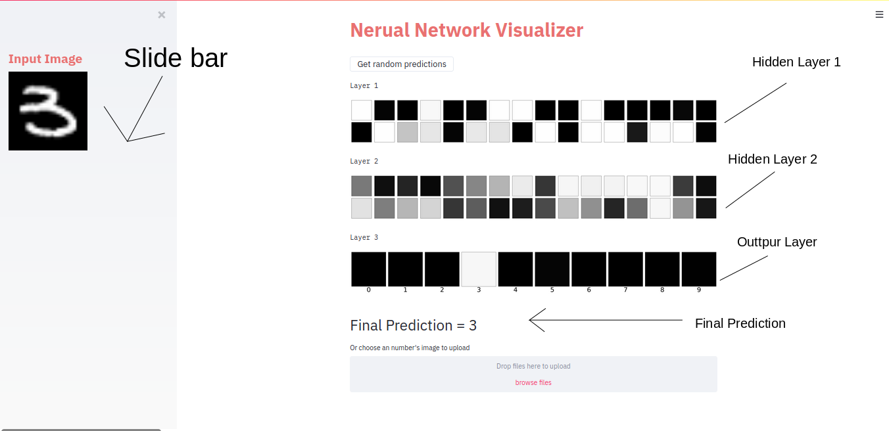
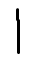

# Neural-Network-Visualizer
https://s4a.streamlit.io/prakash-hash/neural-network-visualizer/master/app.py/+/

A Simple neural network visualizer which is trained on the mnist dataset with simple neural network with tensorflow. 
It shows 3 layers. The first 2 layers are the hidden Dense layer with 32 nodes each and represent 32 subplots in each layer. 
The last layer i.e layer 3 is the output layer and has 10 nodes that shows the propabiblity of the digits from 0-9 and the brighter the node is the greater probability of the number  
All the backend work done in python and the frontend work done on <a href="https://www.streamlit.io/">streamlit</a> which is an awesome library for making a GUI for the the ML models.

If you want to test by uploading an image you can choose the upload image method. Below are some examples of images that shows what should be the format of image

